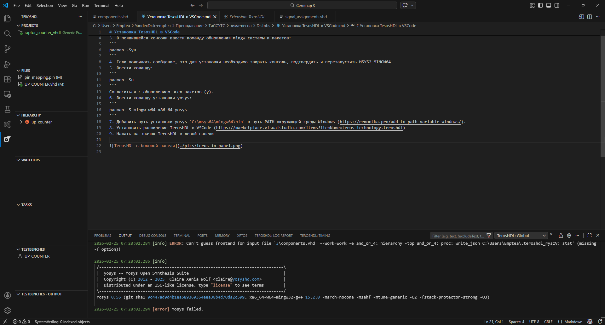
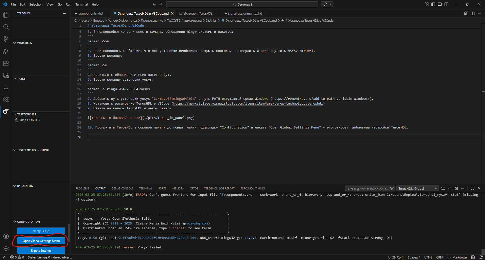
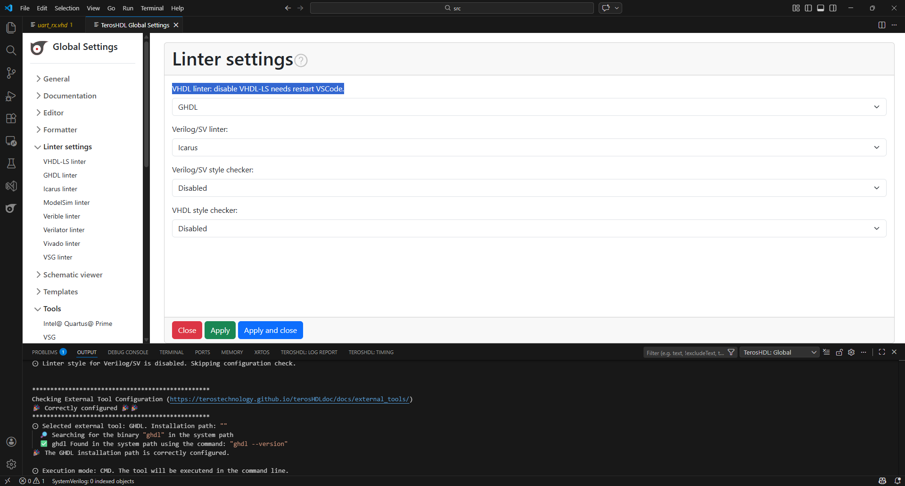
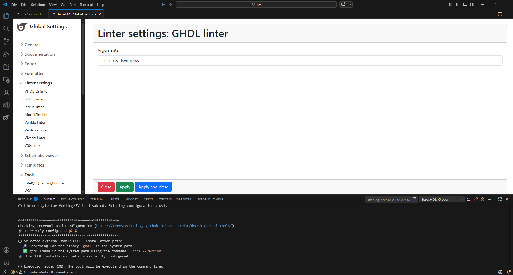
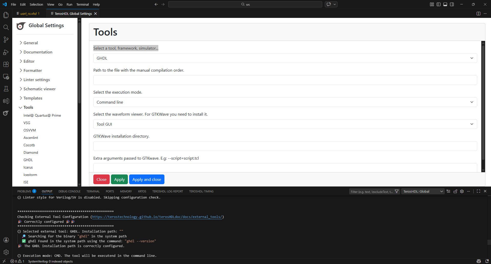
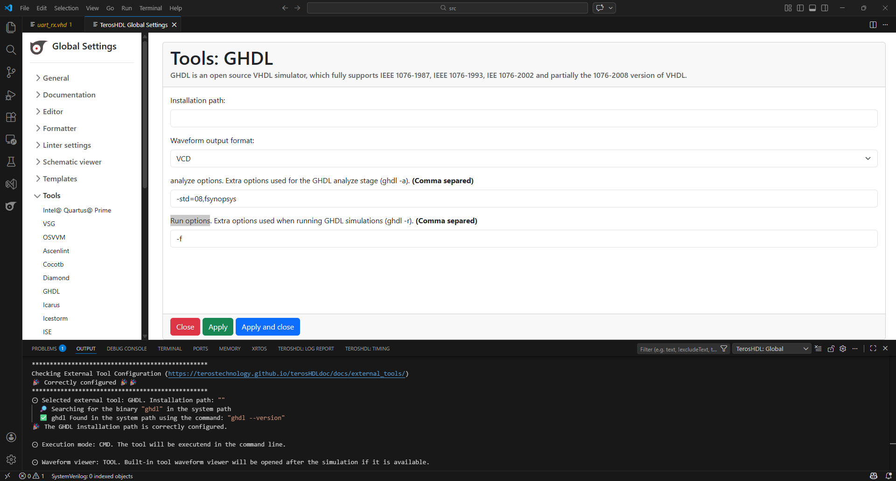
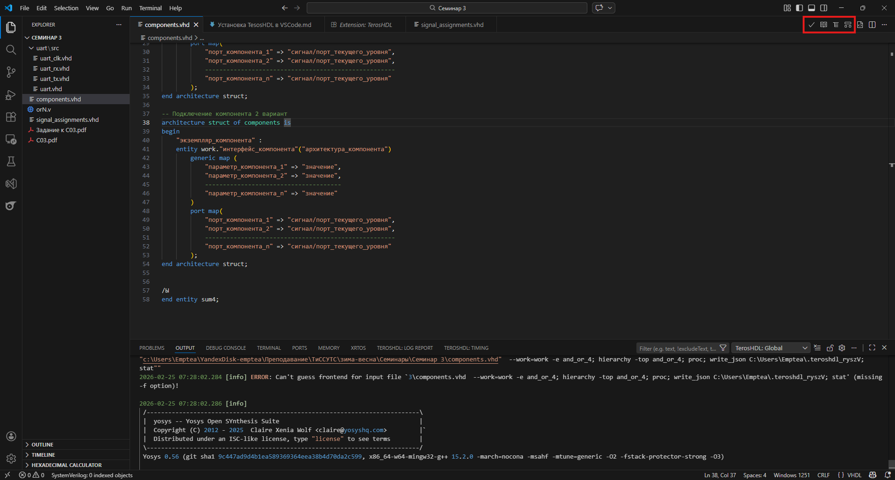

# Установка TesosHDL в VSCode
1. Установить msys2 (https://www.msys2.org/).
2. Открыть MSYS2 MINGW64.
3. В появившейся консоли ввести команду обновления mingw системы и пакетов:
```
pacman -Syu
```
4. Если появилось сообщение, что для установки необходимо закрыть консоль, подтвердить и перезапустить MSYS2 MINGW64.
5. Ввести команду:
```
pacman -Su
```
Согласиться с обновлением всех пакетов (y).
6. Ввести команду установки yosys:
```
pacman -S mingw-w64-x86_64-yosys
```
7. Добавить путь установки yosys `C:\msys64\mingw64\bin` в путь PATH окружающей среды Windows (https://remontka.pro/add-to-path-variable-windows/).
8. Установить расширение TerosHDL в VSCode (https://marketplace.visualstudio.com/items?itemName=teros-technology.teroshdl)
9. Нажать на значок TerosHDL в левой панели



10. Прокрутить TerosHDL в боковой панели до конца, найти подвкладку "Configuration" и нажать "Open Global Settings Menu" - это откроет глобальные настройки TerosHDL.



11. В открывшемся окне настроек открыть вкладку "Linter", в выпадающем списке в поле "VHDL linter: disable VHDL-LS needs restart VSCode." выбрать GHDL:



12. В левом меню настроек выбрать "GHDL Linter" и ввести в поле "Arguments" `--std=08 -fsynopsys`:



13. В левом меню выбрать "Tools", в выпадающем списке в поле "Select a tool, framework, simulator..." выбрать GHDL:



14. В левом меню настроек под выпадающим меню "Tools" выбрать "GHDL" и ввести в поле "analyze options" `-std=08,fsynopsys`, в поле `Run options` - `-f`.



15. Перезапустить VSCode.

16. Для проверки открыть любую папку с файлами, не содержащую пробелов и русских букв в пути, с VHDL-кодом и последовательно проверить функции TerosHDL - кнопки "Format", "Module documentation preview", "Schematic Viewer" и "State machine viewer" в правом верхнем углу редактора:


